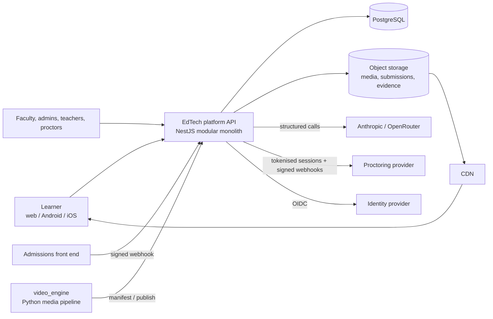

# Architecture overview (C4-style, text)

## Context

## Containers and modules (one deployable, split-ready)
| Module | Responsibility | Key tables |
|---|---|---|
| security (auth, sessions, MFA, OIDC) | identity, sessions, lockout | User, UserSession, RefreshToken |
| authoring + content | versions, workflow, quizzes, assets, labs | ProgrammeVersion, Topic, ContentAsset, Quiz, LabActivity |
| ai (gateway, prompts, generation, config) | provider-neutral model access, jobs, quality gates | AiCall, PromptTemplate, GenerationJob, QualityFinding |
| learning (+media, offline) | gating, events, quizzes, signed streaming, device-bound licences | TopicProgress, LearningEvent, OfflineLicense |
| tutor + doubts | grounded Q&A, ticketing, routing, FAQ review | TutorChunk, TutorMessage, DoubtTicket |
| grading | policy-driven AI grading, moderation, appeals | GradeRecord, SubmissionGrade, ModerationTask |
| exams + labs + proctoring | eligibility, delivery, incidents, release | ExamAttempt, ExamEvent, Incident |
| privacy | consent, export, erasure, retention | ConsentRecord, DataSubjectRequest |
| platform (health, metrics, limits, logging) | operability | - |

Workers (same codebase, `AI_WORKER=1`): job queue (`FOR UPDATE SKIP LOCKED`), doubt/exam/privacy sweeps. Stateless; scale horizontally.

## Cross-cutting decisions
Append-only evidence with hash chains; every state change and its audit event commit in one transaction; maker-checker for publication,
overrides, release, erasure; provider-neutral AI with human review; server-side gating; PII minimisation toward third parties;
secure-by-default configuration enforced at boot. Full list: `docs/decision-log.md`.

## Data flows worth knowing
Exam submit: autosave (seq, token) -> hash-chained events -> submit -> receipt -> hold/adjudicate -> release. Grading: submit -> job ->
extract -> integrity signals -> (sandbox) -> model -> evidence verification -> route (auto/moderator) -> release -> appeal window.
